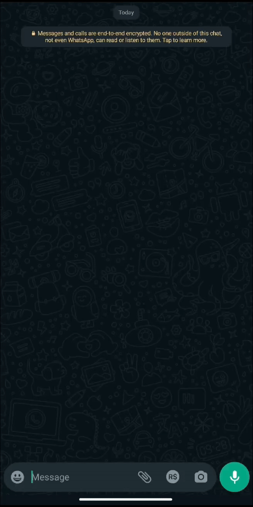

<h1 align="center">🤖 eco-bot</h1>

---

## Apresentação | 📖

O eco-bot é um assistente virtual para WhatsApp projetado para otimizar o seu tempo diário, oferecendo a funcionalidade de transcrição de áudios para texto. 



## Pré-Requisitos | ⚙️

- [Docker](https://docs.docker.com/get-docker/)
- [Huggingface Access Token](https://huggingface.co/docs/hub/security-tokens)

## Como Rodar | 🔨

Crie um arquivo `.env` na raiz do projeto e copie as chaves do `.env.example` para ele através do comando:

```bash
cp .env.example .env
```

Preencha o `.env` com sua [Chave de Acesso do Huggingface](https://huggingface.co/docs/hub/security-tokens)

Suba o container com a image do app através do comando:

```bash
docker compose up -d
```

Acesse os logs do container e escaneie o QR Code atráves do whatsapp para se autenticar.

```bash
docker compose logs -f
```

:warning: **É altamente recomendado utilizar um número de testes para evitar que seu número pessoal seja banido do whatsapp.** 

Quando ver a mensagem `Client is ready! 🚀` no terminal, significa que está tudo pronto! :tada:

## Tecnologias Utilizadas | 📦

- NodeJS
- Typescript

## Como contribuir | 🤝

Agradecemos por considerar contribuir para o eco-bot. Sua ajuda é fundamental para melhorar e expandir este projeto. Aqui estão algumas maneiras pelas quais você pode contribuir:

1. Relatar Problemas
Se encontrar algum problema ou bug, por favor, abra uma issue descrevendo detalhadamente o problema. Inclua informações sobre como reproduzir o erro, seu ambiente de desenvolvimento e qualquer outra informação relevante.

2. Sugerir Melhorias
Se você tem ideias para novos recursos, melhorias de usabilidade ou qualquer outra sugestão, sinta-se à vontade para compartilhá-las em uma issue dedicada a propostas de melhorias.

3. Contribuir com Código
Se deseja contribuir diretamente com código, siga estes passos:

- Faça um fork do repositório.
- Crie uma branch para suas alterações: git checkout -b feature-nova.
- Faça suas modificações e commit: git commit -m 'Adiciona nova funcionalidade'.
- Envie suas alterações para o seu fork: git push origin feature-nova.
- Abra um pull request descrevendo suas alterações.

---

<p align="center">Com 💚 por <a href="https://www.linkedin.com/in/johelder/">Johelder</a></p>
